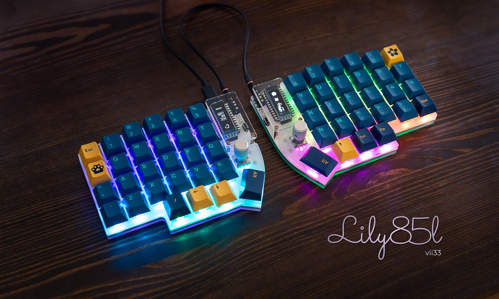

# Lily85L Keyboard

A modified Lily58 PCB, with underglow, per key RGB light and rotary encoder support.

## Documentation

You can find further infos about the hardware and my software changes in the [code repository](https://github.com/vii33/lily58l_qmk_firmware/blob/master/keyboards/lily58/keymaps/lily58l_vii33/readme.md).

### OLED

Left OLED features Luna, the keyboard dog.

Right OLED featues my own Super Mario World animation. 

The assets are from [pixilart.com](https://www.pixilart.com) - great tool by the way.